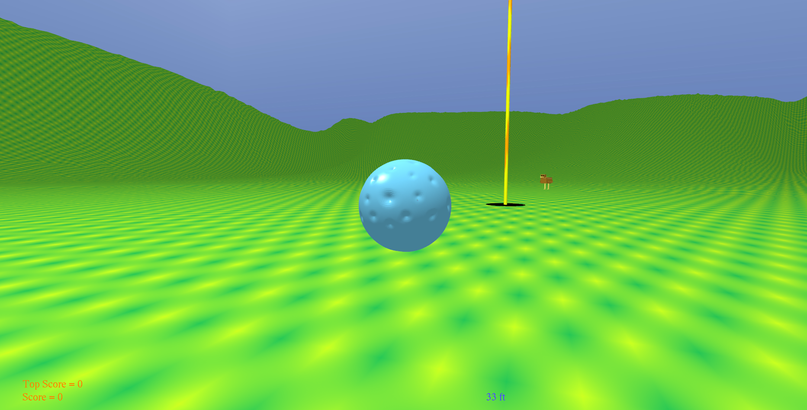
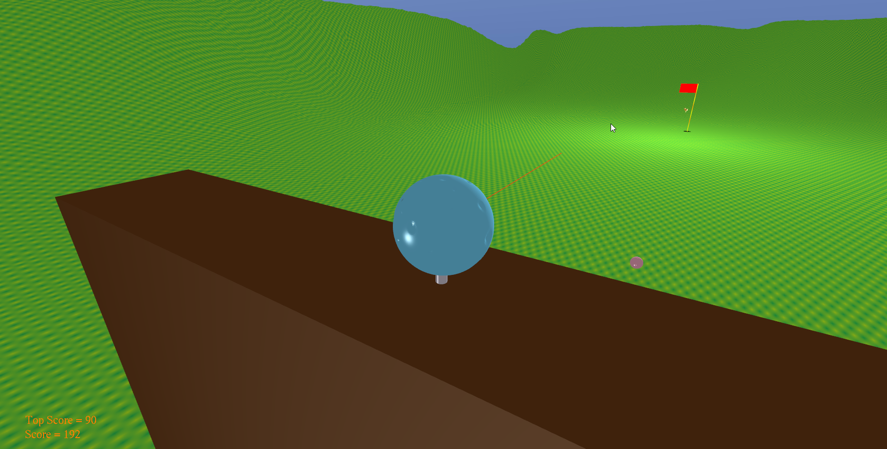

# Closest To The Pin

## Description
This is a simple golf minigame in which the player attempts to hit a golf ball as close to the pinned hole as possible. It also features basic multiplayer functionality.
Makes use of the TAGE (Another Tiny Game Engine) library by Scott Gordon at California State University, Sacramento.

## Installation
The following libraries are also required but not included:
- JOGL
- JOML
- VecMath
- JBullet
- JInput

JInput must be installed as a PATH global variable on your computer. The other libraries must be installed as CLASSPATH global variables on your computer.

1. (This step is only required the first time you play!) Run clearClassFiles.bat to clear any old class files. Then run buildTAGE.bat, compileClient.bat and compileServer.bat.
2. To start a single player game, run runClient.bat. When prompted to enter server perameters, enter any number (example: 1 and 1). You'll be prompted to set a screen resolution. After doing so, the game will launch.
3. To start a multiplayer game, run runServer.bat and enter a server port number. Then run runClient.bat (on this or another machine) and enter the IP address of the machine running the server and the chosen port number. You'll be prompted to set a screen resolution. After doing so, the game will launch.
(Note: you may need to configure you computer to accept UDP traffic for the server to function correctly across multiple machines.)

## Controls
- `Space` - Set direction/set power and hit the ball
- `Arrow Keys` - Move the camera
- `Q and E` - Zoom the camera in and out

## Screenshots

